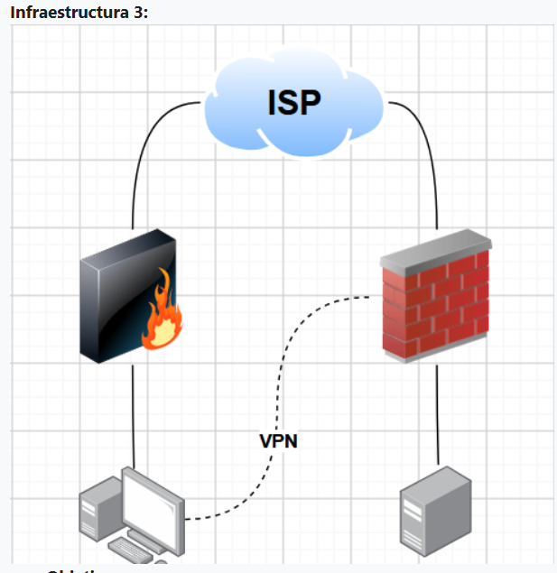
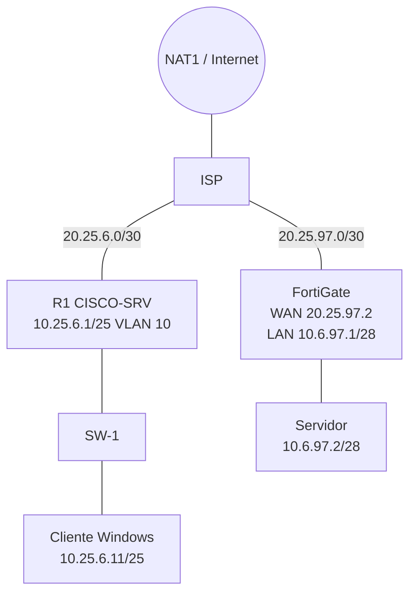
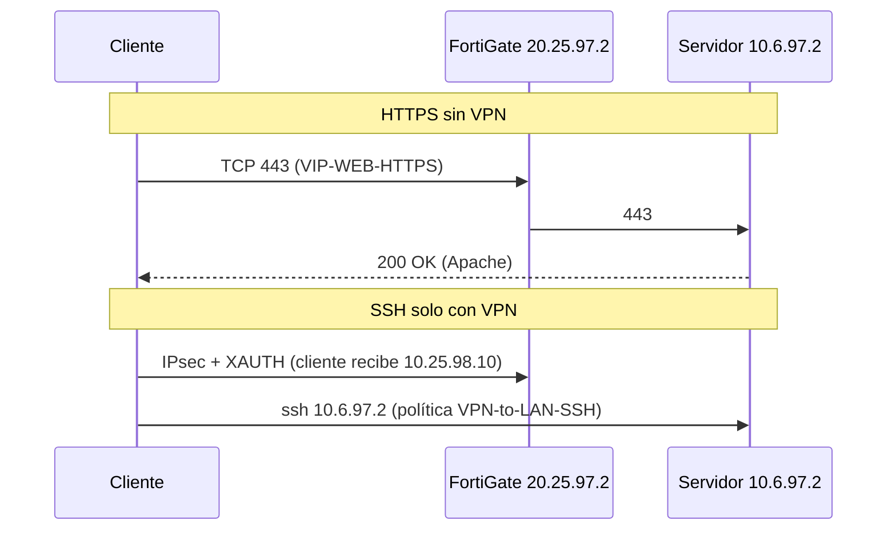
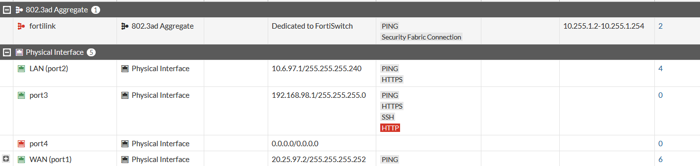
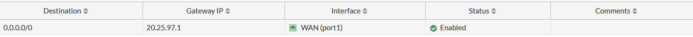
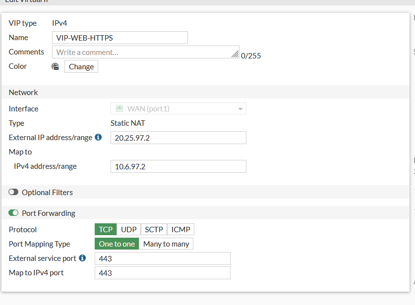
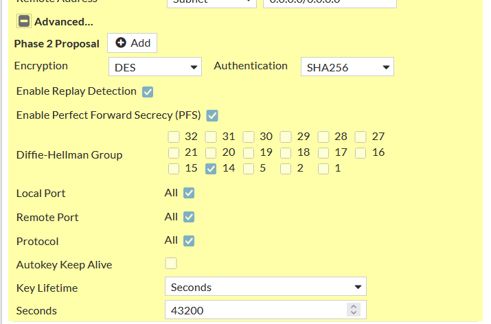
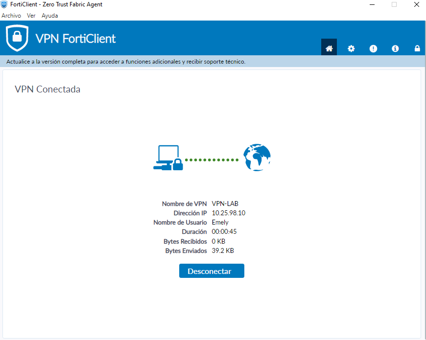
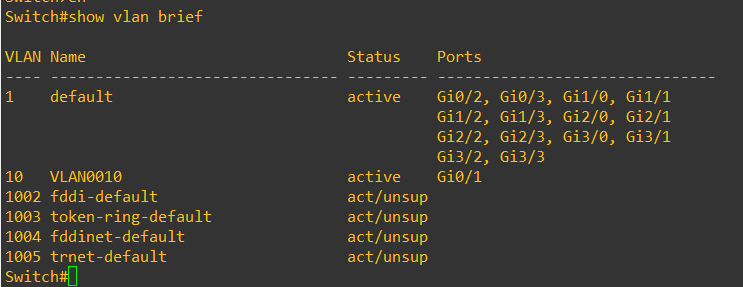
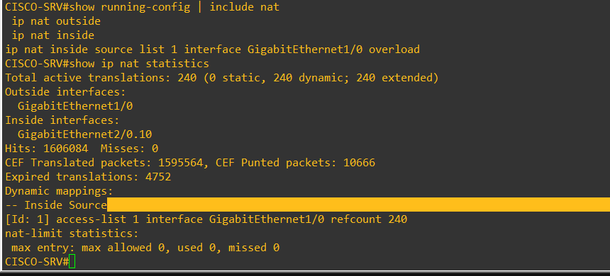

# FortiGate VPN & Web Server Security Lab

## 🎥 Video demostrativo
[video](https://youtu.be/ODGLo07VRjQ)

## Propósito del laboratorio
Implementar la **Infraestructura 3** del enunciado: un usuario (red `/25`, VLAN 10, DHCP) debe

1. acceder al **servidor web por HTTPS sin necesidad de VPN**, y
2. acceder al servidor por **SSH únicamente a través de una VPN**,

con un **FortiGate configurado y demostrado por GUI**, un equipo de red Cisco, un ISP con IP públicas y un servidor `/28`.

## Topología

Más diagramas (Mermaid): [`diagrams/`](diagrams/).

## Direccionamiento
| Elemento | Dirección |
|---|---|
| Usuarios VLAN 10 | `10.25.6.0/25` — gateway `10.25.6.1` (R1 `Gi2/0.10`) |
| Servidor | `10.6.97.2/28` — gateway FortiGate `10.6.97.1` |
| ISP ↔ R1 | `20.25.6.0/30` (.1 ISP, .2 R1) |
| ISP ↔ FortiGate | `20.25.97.0/30` (.1 ISP, .2 FortiGate WAN) |
| VIP HTTPS | `20.25.97.2:443` → `10.6.97.2:443` |
| Pool VPN | `10.25.98.10 – 10.25.98.50` |

## Configuración

### FortiGate (solo GUI)
| Qué | Captura |
|---|---|
| Interfaces: WAN `port1` 20.25.97.2/30 · LAN `port2` 10.6.97.1/28 |  |
| Ruta por defecto `0.0.0.0/0` vía `20.25.97.1` |  |
| VIP `VIP-WEB-HTTPS` (TCP 443) |  |
| Objetos de dirección |  |
| Usuario `Emely` y grupo `VPN-USERS` |   |
| **Políticas de firewall** |  |

Políticas: `WAN-to-WEB-HTTPS` (all → VIP, HTTPS) · `VPN-to-LAN-SSH` (rango VPN → 10.6.97.0/28, PING/SSH) · `LAN-to-VPN` · `LAN-to-WAN` (NAT) · Implicit Deny. Solo hay VIP para el 443, no para el 22.

### VPN (IPsec dial-up con FortiClient)
IKEv1 **Aggressive**, PSK + XAUTH (grupo `VPN-USERS`), Phase 1 y 2: **DES/SHA256, DH 14** (Phase 1: 86400 s; Phase 2: PFS, 43200 s). Cliente FortiClient `VPN-LAB` → `20.25.97.2`.

  
 
 

### Cisco (R1, SW-1, ISP) — VLAN 10 y DHCP
- **SW-1:** VLAN 10, `Gi0/1` acceso, `Gi0/0` trunk (solo VLAN 10).
- **R1:** subinterfaz `Gi2/0.10` (`10.25.6.1/25`), pool DHCP `USUARIOS-V10` (excluidas .1–.10), NAT overload por `Gi1/0`.
- **ISP:** enlaces 20.25.6.0/30 y 20.25.97.0/30, NAT hacia Internet.

   

Running-configs en [`configs/`](configs/); comandos aplicados en [`scripts/`](scripts/).

### Servidor web (Apache HTTPS + SSH)
`eth0` = `10.6.97.2/28`; Apache con vhost SSL en el 443 y OpenSSH en el 22.

  

## Pruebas
| ID | Prueba | Evidencia | Resultado | Estado |
|---|---|---|---|---|
| T1 | DHCP VLAN 10 | [binding](images/cisco_dhcp_binding.png) | Cliente `10.25.6.11/25` | PASS |
| T2 | Internet | [ping](images/test_ping_internet.png) | 4/4, TTL 125 | PASS |
| T3 | HTTPS (TLS) | [curl](images/test_https_curl.png) | `curl -vk https://20.25.97.2` → `200 OK`, Apache | PASS |
| T4 | HTTPS **sin VPN** | [TCP 443](images/test_https_tcp443.png), [página](images/test_web_page.png) | `TcpTestSucceeded True`; página "Servidor Web - Lab 2025-0697" | PASS |
| T5 | VPN establecida | [FortiClient](images/vpn_forticlient_connected.png), [monitor](images/vpn_monitor_up.png) | IP `10.25.98.10`, 1 dialup | PASS |
| T6 | **SSH por VPN** | [ssh](images/server_ssh_login.png) | Sesión a `10.6.97.2` exitosa; el origen VPN solo se ve en "Last login" | **PARTIAL** |
| T7 | SSH bloqueado sin VPN | [puerto 22](images/test_ssh_blocked.png) | `TcpTestSucceeded False` a 20.25.97.2:22 | PASS |
| T8 | Traceroute sin VPN → `20.25.97.2` | [tracert](images/test_tracert_public.png) | 10.25.6.1 → 20.25.6.1 → 20.25.97.2 | PASS |
| T9 | Traceroute al servidor `10.6.97.2` | [VPN off](images/test_tracert_vpn_off.png) / [VPN on](images/test_tracert_vpn_on.png) | Off: timeouts. On: 169.254.1.1 → 10.6.97.2 | PASS |
| T10 | Logs de firewall | — | Sin logs; `LAN-to-VPN` en 0 B | PENDING |

## Cumplimiento de los requisitos de entrega
| Requisito | Estado | Dónde |
|---|---|---|
| Repositorio de GitHub | Listo para subir | este repo |
| Documentación profesional | ✅ | este README |
| Video al inicio |✅ | primera sección |
| Imágenes | ✅ 33 capturas reales | [`images/`](images/) |
| Diagramas | ✅ | Topología/flujo arriba y [`diagrams/`](diagrams/) |
| Propósito del laboratorio | ✅ | sección "Propósito" |
| Scripts utilizados | ✅ listados de comandos (no hay `.sh`) | [`scripts/`](scripts/) |
| Running-configs | ✅ R1, SW-1, ISP | [`configs/`](configs/) |

- Nombre y matrícula aparecen en banners/capturas (`EMELY CARRASCO 2025-0697`).
