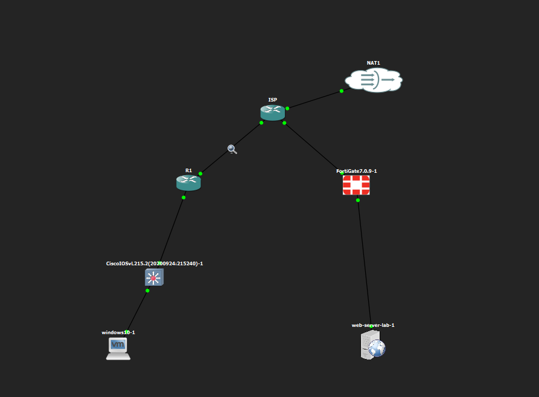
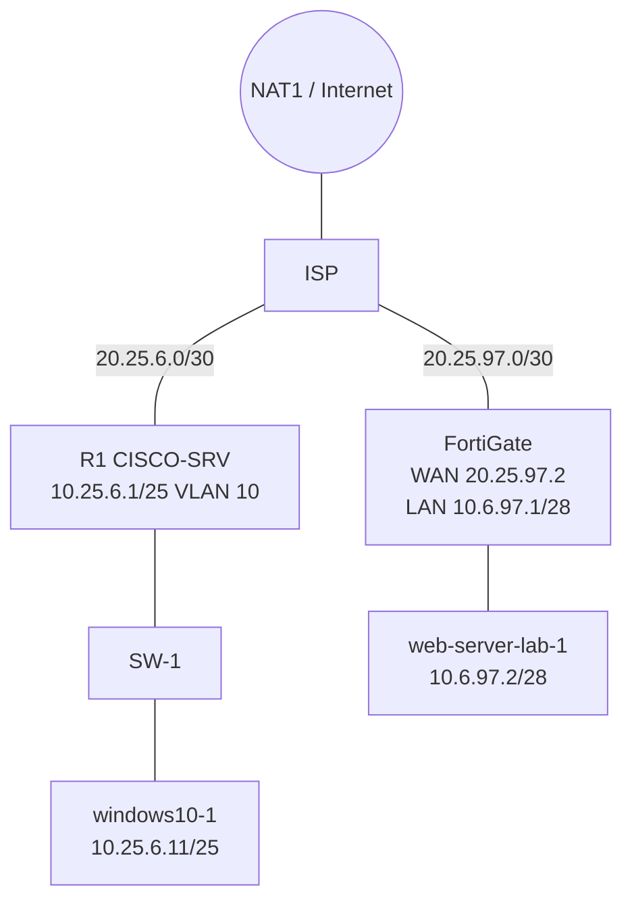
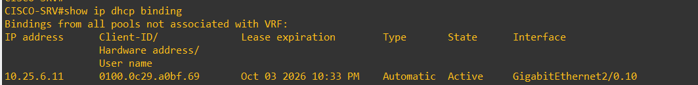

# FortiGate VPN & Web Server Security Lab

## 🎥 Video demostrativo
](https://youtu.be/ODGLo07VRjQ)
> **Política de evidencia:** todo lo documentado proviene de capturas y configuraciones reales. Lo no demostrado se marca `PARTIAL`, `PENDING EVIDENCE`, `NOT EXECUTED` o `UNKNOWN / NEEDS VERIFICATION`.

## Objetivo
Infraestructura 3 del enunciado: el usuario accede al servidor web **sin VPN** (HTTPS) y al servidor por **SSH únicamente vía VPN**, con un FortiGate configurado y demostrado **por GUI**.

## Descripción del laboratorio
Un cliente Windows en VLAN 10 (`10.25.6.0/25`, DHCP) sale por R1 (Cisco) → ISP → FortiGate, que publica el servidor `10.6.97.2/28` mediante una VIP HTTPS en `20.25.97.2` y ofrece una VPN IPsec dial-up (FortiClient) para el acceso SSH.


## Arquitectura y topología



Diagramas fuente: [`docs/diagrams/`](docs/diagrams/) · Detalle: [03-topology](docs/03-topology.md).

## Tecnologías utilizadas
GNS3 · FortiGate 7.0.9 (GUI) · FortiClient (IPsec) · Cisco IOSv / IOSvL2 · Ubuntu (servidor, OpenSSH, servicio en 443) · Windows 10.

## Tabla de direccionamiento
| Elemento | Dirección |
|---|---|
| Usuarios VLAN 10 | 10.25.6.0/25 (GW 10.25.6.1) |
| Servidor | 10.6.97.2/28 (FortiGate LAN 10.6.97.1) |
| ISP ↔ R1 | 20.25.6.0/30 (.1 ISP, .2 R1) |
| ISP ↔ FortiGate | 20.25.97.0/30 (.1 ISP, .2 FortiGate WAN) |
| VIP HTTPS | 20.25.97.2:443 → 10.6.97.2:443 |
| Pool VPN | 10.25.98.10 – 10.25.98.50 |

Más en [04-ip-addressing](docs/04-ip-addressing.md).

## VLAN y DHCP
VLAN 10 en SW-1 (trunk `Gi0/0`, acceso `Gi0/1`), subinterfaz `Gi2/0.10` en R1, pool `USUARIOS-V10`. Cliente: `10.25.6.11`.

Ver [06-vlan-dhcp](docs/06-vlan-dhcp.md), [07-cisco](docs/07-cisco.md).

## FortiGate (GUI)
Interfaces, ruta, VIP, objetos, políticas, usuario y grupo: [05-fortigate](docs/05-fortigate.md).


## VPN
IPsec dial-up `VPN-REMOTE`, IKEv1 Aggressive, PSK + XAUTH (`VPN-USERS`), Phase 1/2 DES-SHA256 DH14, cliente FortiClient `VPN-LAB`. Detalle: [09-vpn](docs/09-vpn.md).


## Web Server, HTTPS y SSH
El servidor tiene los puertos **443 y 22 en LISTEN**. El acceso **HTTPS funciona sin VPN** (TEST-004). El acceso **SSH se realiza mediante la VPN** (TEST-007, evidencia parcial) y **está bloqueado desde Internet** (TEST-008). El servicio HTTPS es **Apache con vhost SSL en el 443** y responde `200 OK` por TLS (`curl -vk`, TEST-003/015); solo falta el detalle del certificado (TEST-013). Ver [08-web-server](docs/08-web-server.md).

## Firewall
Ver [10-firewall](docs/10-firewall.md).

## Pruebas
| ID | Prueba | Evidencia | Resultado | Estado |
|---|---|---|---|---|
| TEST-001 | DHCP VLAN 10 | [binding](docs/images/03-cisco/cisco_r1_dhcp_binding.png) | 10.25.6.11/25 | PASS |
| TEST-002 | Conectividad | [ping](docs/images/06-tests/test_ping_internet_8.8.8.8.png) | 4/4, TTL 125 | PASS |
| TEST-003 | HTTPS (TLS) | [curl](docs/images/06-tests/test_https_curl_tls_response.png) | `HTTP/1.1 200 OK` sobre 443, Apache/2.4.52 | PASS |
| TEST-004 | HTTPS sin VPN | [443](docs/images/06-tests/test_https_tcp443_without_vpn.png) | TcpTestSucceeded True | PASS |
| TEST-005 | VPN | [FortiClient](docs/images/05-vpn/forticlient_connected.png) | Conectada, 10.25.98.10 | PASS |
| TEST-006 | Ruta por VPN | [tracert](docs/images/06-tests/test_traceroute_private_ip_vpn_on.png) | 169.254.1.1 → 10.6.97.2 | PASS |
| TEST-007 | SSH vía VPN | [ssh](docs/images/04-server/server_ssh_login_success.png) | Sesión exitosa; origen VPN solo indirecto | PARTIAL |
| TEST-008 | SSH bloqueado | [22](docs/images/06-tests/test_ssh_blocked_without_vpn.png) | TCP 22 falla | PASS |
| TEST-009 | Traceroute | [tracert](docs/images/06-tests/test_traceroute_public_ip_without_vpn.png) | 3 saltos | PASS |
| TEST-010 | Firewall | [políticas](docs/images/02-fortigate/fortigate_firewall_policies.png) | Coherente; sin logs | PARTIAL |
| TEST-013 | Detalle del certificado | — | Sin captura del certificado | PENDING EVIDENCE |

Tabla completa: [11-testing](docs/11-testing.md).

## Evidencias
Estructura: `docs/images/01-topology … 06-tests` (37 imágenes reales, sin alterar). Capturas excluidas: ver [CHANGELOG](CHANGELOG.md).

## Seguridad
Secretos redactados; debilidades conocidas (DES, Aggressive, `all→all`) en [13-security](docs/13-security.md).

## Troubleshooting
[12-troubleshooting](docs/12-troubleshooting.md).

## Estructura del repositorio
```
fortigate-vpn-web-lab/
├── README.md  AUDIT-CHECKLIST.md  CHANGELOG.md  LICENSE  .gitignore
├── docs/            01-overview … 14-conclusions, final-review
│   ├── diagrams/    *.mmd (Mermaid)
│   └── images/      01-topology … 06-tests
├── configs/         cisco/  server/  fortigate/ (sin CLI)
├── scripts/         scripts de validación generados
├── tests/           comandos de prueba
└── assets/
```

## Requirements Traceability Matrix
| Requisito | Evidencia | Archivo | Sección | Estado |
|---|---|---|---|---|
| Web sin VPN | VIP + política + TCP 443 + página | [`test_https_tcp443_without_vpn.png`](docs/images/06-tests/test_https_tcp443_without_vpn.png) | [11-testing](docs/11-testing.md) TEST-004 | PASS |
| SSH vía VPN | Sesión SSH, política, monitor | [`server_ssh_login_success.png`](docs/images/04-server/server_ssh_login_success.png) | TEST-007 | PARTIAL |
| FortiGate por GUI | Capturas GUI | [`fortigate_interfaces.png`](docs/images/02-fortigate/fortigate_interfaces.png) | [05-fortigate](docs/05-fortigate.md) | PASS |
| VPN Remote-Site (cliente–servidor) | Resumen, Phase 1/2, monitor | [`fortigate_ipsec_phase1.png`](docs/images/05-vpn/fortigate_ipsec_phase1.png) | [09-vpn](docs/09-vpn.md) | PASS |
| Equipo Cisco | running-configs R1/SW-1/ISP | [`R1_CISCO-SRV_running-config.txt`](configs/cisco/R1_CISCO-SRV_running-config.txt) | [07-cisco](docs/07-cisco.md) | PASS |
| ISP (IP públicas) | running-config ISP | [`ISP_running-config.txt`](configs/cisco/ISP_running-config.txt) | [04-ip-addressing](docs/04-ip-addressing.md) | PASS |
| Servidor /28 | `ip a` | [`server_ip_eth0.png`](docs/images/04-server/server_ip_eth0.png) | [08-web-server](docs/08-web-server.md) | PASS |
| Servidor HTTPS | Apache 443 + curl | [`server_apache_ss_443_and_vhosts.png`](docs/images/04-server/server_apache_ss_443_and_vhosts.png), [`test_https_curl_tls_response.png`](docs/images/06-tests/test_https_curl_tls_response.png) | TEST-003/015 | PASS |
| Servidor SSH | netstat 22, sesión | [`server_ssh_login_success.png`](docs/images/04-server/server_ssh_login_success.png) | 08-web-server | PASS |
| Usuarios /25 | ipconfig | [`client_ipconfig_vpn_and_lan.png`](docs/images/05-vpn/client_ipconfig_vpn_and_lan.png) | [06-vlan-dhcp](docs/06-vlan-dhcp.md) | PASS |
| VLAN 10 | show vlan brief | [`cisco_sw_show_vlan_brief.png`](docs/images/03-cisco/cisco_sw_show_vlan_brief.png) | 06-vlan-dhcp | PASS |
| DHCP | binding | [`cisco_r1_dhcp_binding.png`](docs/images/03-cisco/cisco_r1_dhcp_binding.png) | 06-vlan-dhcp | PASS |
| Traceroute | tracert con/sin VPN | [`test_traceroute_private_ip_vpn_on.png`](docs/images/06-tests/test_traceroute_private_ip_vpn_on.png) | TEST-009 | PASS |
| Diagramas | Mermaid | [`network-topology.mmd`](docs/diagrams/network-topology.mmd) | [03-topology](docs/03-topology.md) | PASS |
| Running-configs | Cisco | [`configs/`](configs/README.md) | 07-cisco | PASS |
| Scripts | Ninguno aportado | [`scripts/README.md`](scripts/README.md) | — | N/A |
| Video | — | — | Inicio del README | PENDING EVIDENCE |

## Evidence Gaps y Potential Evaluation Issues
Ver [`docs/final-review.md`](docs/final-review.md).

## Conclusiones
[14-conclusions](docs/14-conclusions.md).

## Submission Checklist
- [x] Documentación, diagramas, imágenes, running-configs, matriz de trazabilidad
- [x] Secretos redactados
- [ ] Enlace del video (reemplazar `VIDEO_URL_PLACEHOLDER`)
- [x] Evidencia HTTPS/TLS (curl + Apache)
- [ ] (Opcional) Detalle del certificado (TEST-013)
- [ ] Captura SSH vía VPN única (G2)
- [ ] `show interfaces trunk` / `show ip interface brief` (G3)
- [ ] Confirmar publicación de nombre/matrícula
- [ ] Subir a GitHub
