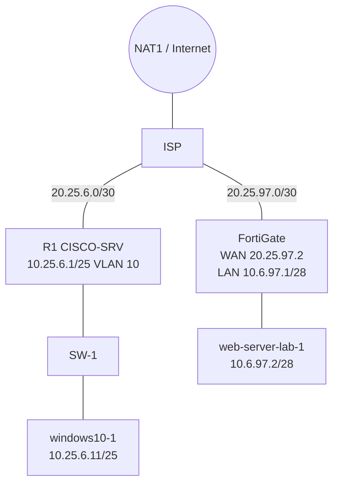

# 03 · Topología

Captura real de GNS3 ([`gns3_topology.png`](images/01-topology/gns3_topology.png)):

**Qué se observa:** `NAT1 → ISP`; `ISP → R1 → CiscoIOSvL2 → windows10-1`; `ISP → FortiGate7.0.9-1 → web-server-lab-1`. Los puntos verdes indican enlaces activos.
**Limitación:** la captura no muestra los nombres de los puertos de cada enlace; las correspondencias de puerto (p. ej. `R1 Gi2/0 ↔ SW Gi0/0`) se deducen de las configuraciones y están marcadas como `UNKNOWN / NEEDS VERIFICATION` donde corresponde.

## Diagramas fuente (Mermaid)
| Archivo | Contenido |
|---|---|
| [`network-topology.mmd`](diagrams/network-topology.mmd) | Topología completa con IP |
| [`vlan-topology.mmd`](diagrams/vlan-topology.mmd) | Trunk/VLAN 10/DHCP |
| [`vpn-topology.mmd`](diagrams/vpn-topology.mmd) | VPN dial-up |
| [`https-flow.mmd`](diagrams/https-flow.mmd) | Flujo HTTPS sin VPN |
| [`ssh-flow.mmd`](diagrams/ssh-flow.mmd) | Flujo SSH vía VPN |

