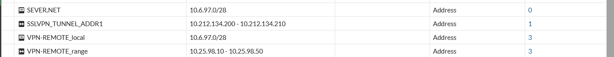
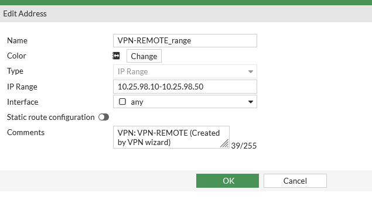
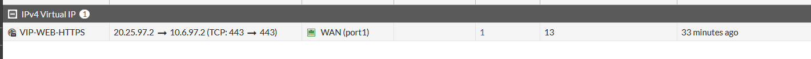
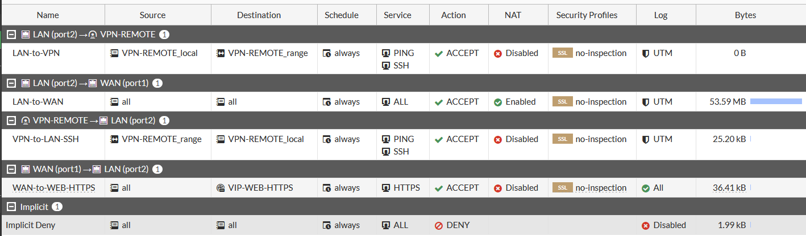
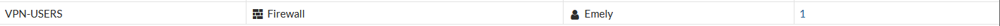

# 05 · FortiGate (solo GUI)

> Todas las capturas de esta sección son de la **GUI** del FortiGate. No se incluye CLI de FortiGate porque no se aportó ninguna evidencia CLI.
> Las capturas no muestran la ruta de menú (breadcrumb); las rutas indicadas son las habituales de FortiOS 7.0 y se marcan como *(menú presumido)*. Versión: la etiqueta GNS3 dice `FortiGate7.0.9-1`; la GUI no muestra la versión.

## 1. Interfaces — *Network > Interfaces (menú presumido)*

- **Se observa:** `WAN (port1)` 20.25.97.2/255.255.255.252 con acceso administrativo **PING**; `LAN (port2)` 10.6.97.1/255.255.255.240 con **PING y HTTPS**; `port3` 192.168.98.1/255.255.255.0 con PING/HTTPS/SSH y **HTTP resaltado en rojo**; `port4` sin configurar; agregado `fortilink` (por defecto).
- **Demuestra:** R04 (configuración de red), direccionamiento /28 del lado servidor.
- **Importante:** WAN **no** permite SSH ni HTTPS administrativo → el 443 que responde en 20.25.97.2 proviene de la VIP, y el ping responde desde la propia interfaz WAN.

## 2. Ruta estática — *Network > Static Routes (menú presumido)*

- `0.0.0.0/0` vía `20.25.97.1` por `WAN (port1)`, **Enabled**. Es el ISP (`Gi2/0`).

## 3. Objetos de dirección — *Policy & Objects > Addresses (menú presumido)*

| Objeto | Valor |
|---|---|
| `SEVER.NET` (sic) | 10.6.97.0/28 (Ref. 0, sin uso) |
| `VPN-REMOTE_local` | 10.6.97.0/28 |
| `VPN-REMOTE_range` | 10.25.98.10 – 10.25.98.50 |
| `SSLVPN_TUNNEL_ADDR1` | 10.212.134.200 – 210 (objeto por defecto de FortiOS) |

Detalle de `VPN-REMOTE_range`, creado por el asistente VPN ("Created by VPN wizard").

## 4. Virtual IP (VIP) — *Policy & Objects > Virtual IPs (menú presumido)*

- `VIP-WEB-HTTPS`, IPv4, interfaz `WAN (port1)`, **Static NAT**, externa `20.25.97.2` → `10.6.97.2`, *Port Forwarding* TCP **443 → 443** (one-to-one).
- **Demuestra:** publicación del servidor HTTPS sin VPN. No existe VIP para el puerto 22.

## 5. Políticas de firewall — *Policy & Objects > Firewall Policy (menú presumido)*

| Nombre | Origen → Destino | Interfaces | Servicio | Acción | NAT | Bytes |
|---|---|---|---|---|---|---|
| `LAN-to-VPN` | `VPN-REMOTE_local` → `VPN-REMOTE_range` | LAN(port2) → VPN-REMOTE | PING, SSH | ACCEPT | Disabled | 0 B |
| `LAN-to-WAN` | all → all | LAN(port2) → WAN(port1) | ALL | ACCEPT | Enabled | 53.59 MB |
| `VPN-to-LAN-SSH` | `VPN-REMOTE_range` → `VPN-REMOTE_local` | VPN-REMOTE → LAN(port2) | PING, SSH | ACCEPT | Disabled | 25.20 kB |
| `WAN-to-WEB-HTTPS` | all → `VIP-WEB-HTTPS` | WAN(port1) → LAN(port2) | HTTPS | ACCEPT | Disabled | 36.41 kB |
| Implicit Deny | all → all | — | ALL | DENY | — | 1.99 kB (log deshabilitado) |

- **Demuestra:** HTTPS permitido desde WAN solo hacia la VIP; SSH solo desde el rango VPN; todo lo demás cae en *Implicit Deny* (que tiene 1.99 kB acumulados).
- **Observación:** `LAN-to-VPN` tiene 0 B → ese sentido no se ejercitó. `LAN-to-WAN` es `all → all / ALL` (permisiva).

## 6. Usuario y grupo — *User & Authentication (menú presumido)*

Usuario `Emely` (LOCAL, Enabled, sin 2FA, grupo `VPN-USERS`); grupo `VPN-USERS` (tipo Firewall) con miembro `Emely`.

Continúa en [09-vpn.md](09-vpn.md) y [10-firewall.md](10-firewall.md).
