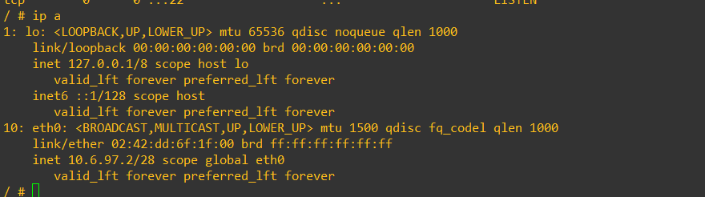
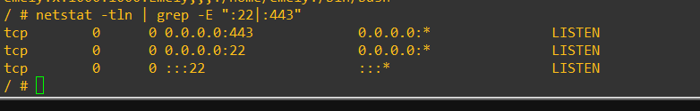
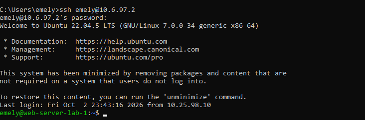
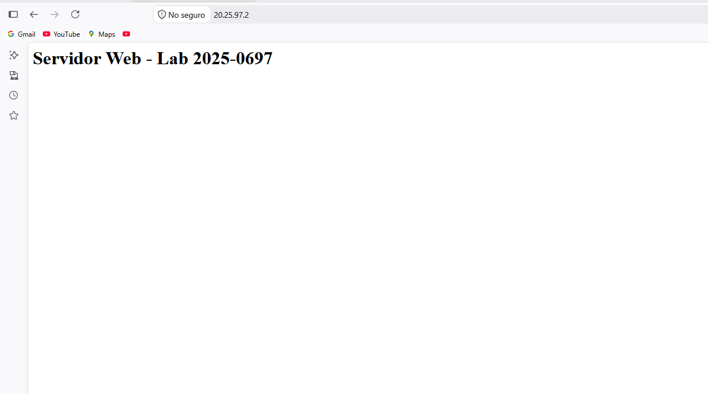
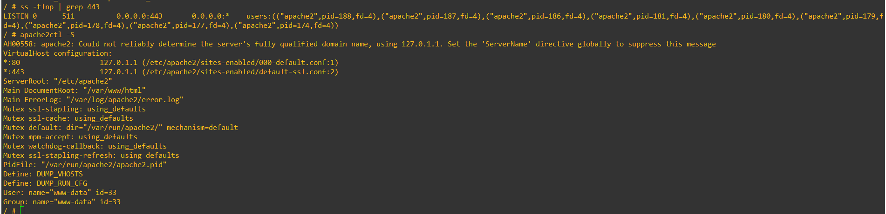
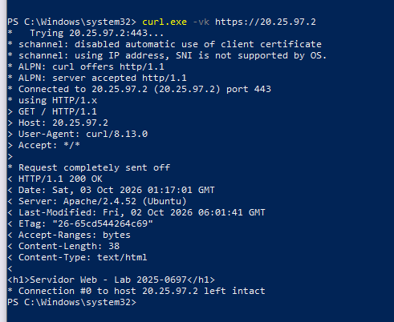
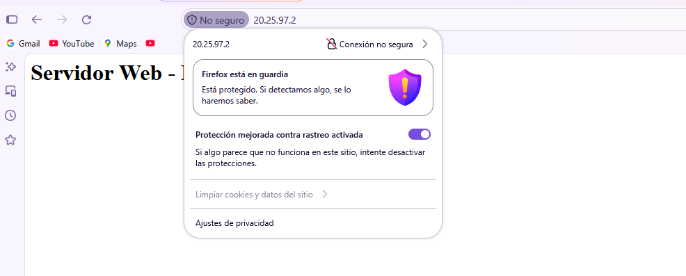

# 08 · Servidor web (HTTPS y SSH)

## Datos observados

`ip a`: `eth0` = **10.6.97.2/28**, MAC `02:42:dd:6f:1f:00`. El prompt `/ #` es de un shell mínimo.


`netstat -tln | grep -E ":22|:443"`: `0.0.0.0:443` LISTEN, `0.0.0.0:22` LISTEN, `:::22` LISTEN. **Demuestra puertos abiertos; no identifica el proceso ni el certificado.**


`ssh emely@10.6.97.2` desde Windows: banner Ubuntu 22.04.5 LTS, "Last login: Fri Oct 2 23:43:16 2026 from 10.25.98.10", prompt `emely@web-server-lab-1`.


Página "Servidor Web - Lab 2025-0697" cargada en `20.25.97.2`.

## Servicio HTTPS (Apache)

- `ss -tlnp | grep 443`: `0.0.0.0:443` en LISTEN con procesos **`apache2`** (varios `pid`, usuario `www-data`).
- `apache2ctl -S`: VirtualHost `*:80` → `/etc/apache2/sites-enabled/000-default.conf` y **`*:443` → `/etc/apache2/sites-enabled/default-ssl.conf`**; `DocumentRoot /var/www/html`. Aviso AH00558 (sin `ServerName`) sin impacto funcional.


- `curl.exe -vk https://20.25.97.2` (`-k` omite la validación del certificado): conecta al 443, ALPN `server accepted http/1.1`, `HTTP/1.1 200 OK`, `Server: Apache/2.4.52 (Ubuntu)`, `Date: Sat, 03 Oct 2026 01:17:01 GMT`, `<h1>Servidor Web - Lab 2025-0697</h1>`.
- Apache 2.4.52 es la versión de Ubuntu 22.04, coherente con la sesión SSH (Ubuntu 22.04.5).


- Firefox muestra "No seguro" y "Conexión no segura" para `20.25.97.2`. Esto es compatible con un certificado autofirmado, pero **por sí sola no demuestra TLS** (HTTP plano daría el mismo mensaje).

## Comandos aportados (`configs/server/server_commands.txt`)
```
apt update
apt install openssh-server -y
mkdir -p /run/sshd
service ssh start
adduser emely
grep emely /etc/passwd
```

## UNKNOWN / NEEDS VERIFICATION
- Certificado usado por `default-ssl.conf` (emisor, validez, autofirmado o no): **no hay evidencia** del contenido.
- Los comandos para instalar/activar Apache y SSL (`apt install apache2`, `a2enmod ssl`, `a2ensite default-ssl`) **no están en los comandos aportados**; solo se ve el resultado.
- El shell de `ip a`/`netstat`/`ss` (`/ #`) y la sesión SSH (Ubuntu 22.04.5, kernel `7.0.0-34-generic`) siguen sin confirmarse como el mismo sistema; Apache/2.4.52 (Ubuntu) es coherente, pero no concluyente (falta `hostnamectl` en la misma sesión).
