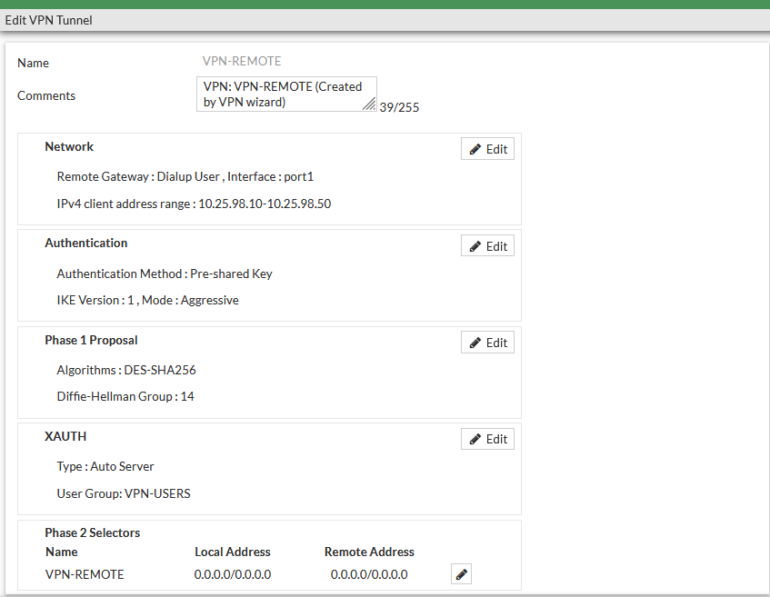
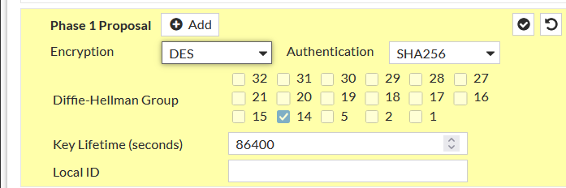
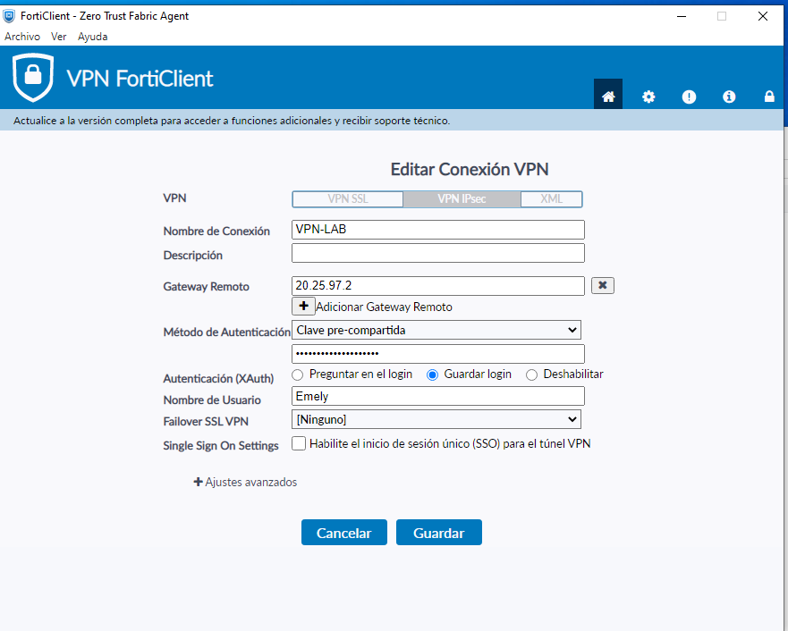
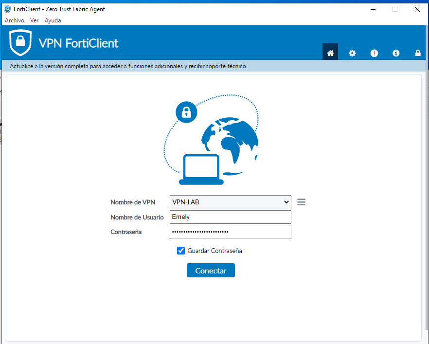
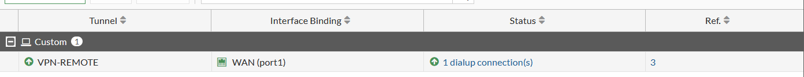
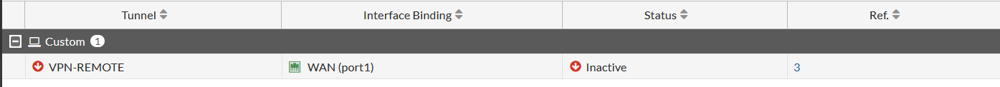
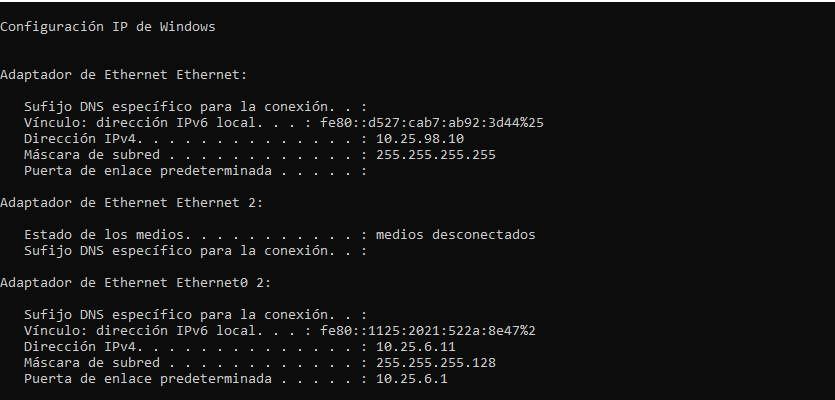
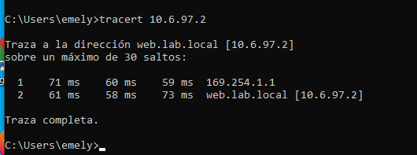

# 09 · VPN (IPsec dial-up con FortiClient)

El diagrama del enunciado dibuja la VPN entre la **PC cliente** y el **FortiGate que protege al servidor** ("VPN Remote-Site entre Cliente y Servidor"). Se implementó como **IPsec de acceso remoto (dial-up)** con FortiClient. No es un túnel entre dos FortiGate.

## Parámetros reales (GUI)

| Parámetro | Valor observado |
|---|---|
| Nombre | `VPN-REMOTE` (creado con el asistente VPN) |
| Remote Gateway | Dialup User, interfaz `port1` |
| Rango de clientes | 10.25.98.10 – 10.25.98.50 |
| Autenticación | Pre-shared Key (valor **no** visible) |
| IKE | Versión 1, modo **Aggressive** |
| XAUTH | Auto Server, grupo `VPN-USERS` |
| Phase 1 | DES / SHA256, DH 14 |
| Phase 2 (selector `VPN-REMOTE`) | Local 0.0.0.0/0 · Remote 0.0.0.0/0 |

Phase 1: cifrado **DES**, autenticación **SHA256**, DH **14**, lifetime **86400 s**, Local ID vacío.

Phase 2: **DES / SHA256**, Replay Detection ✔, **PFS ✔ (DH 14)**, puertos y protocolo "All", Autokey Keep Alive ✘, lifetime **43200 s**.

## Cliente (FortiClient)

Perfil `VPN-LAB`: VPN IPsec, gateway `20.25.97.2`, clave pre-compartida (oculta), XAuth "Guardar login", usuario `Emely`.

Pantalla de conexión (contraseña oculta).

## Estado del túnel

FortiClient: "VPN Conectada", IP **10.25.98.10**, usuario Emely, duración 00:00:45, 39.2 KB enviados / 0 KB recibidos.

Monitor IPsec: `VPN-REMOTE` en `WAN (port1)` con **1 dialup connection** (arriba) frente a **Inactive** (abajo). No muestran fecha/hora, por lo que el orden temporal se asume.

## Enrutamiento por la VPN

El cliente tiene dos interfaces: VPN `10.25.98.10/32` (sin gateway) y LAN `10.25.6.11/25`.

Con VPN: `tracert 10.6.97.2` → salto 1 `169.254.1.1` (gateway link-local del túnel), salto 2 `10.6.97.2`. Sin VPN → ver [11-testing.md](11-testing.md).

## Limitaciones
Phase 1 y 2 usan DES; IKEv1 Aggressive con PSK. Ver [13-security.md](13-security.md).
